---
categories:
- Season 1
- ConvoCanvas
- Planning
date: 2025-10-05
draft: false
episode: 1
reading_time: 7 minutes
series: 'Season 1: From Zero to Automated Infrastructure'
summary: The context window overflow error that sparked a 25-day process from idea
  to fully automated infrastructure. Looking back, this is how it all began.
tags:
- convocanvas
- ai-conversations
- obsidian
- planning
- origin-story
- rag
- ner
- kubernetes
- chromadb
- claude
- prefect
- docker
title: 'Day Zero: The ConvoCanvas Vision'
word_count: 1750
---
# Episode 1: Day Zero - The ConvoCanvas Vision

**Series**: Season 1 - From Zero to Automated Infrastructure
**Episode**: 1 of 8
**Date**: September 11, 2025
**Reading Time**: 7 minutes

---

## 💥 The Error That Started Everything

```
❌ Error: Context window overflow. This conversation is too long to continue.
Would you like to start a new chat?
```

I stared at that message for the third time that week. 😤 I'd just spent two hours debugging a network automation script with Claude, finally getting somewhere, and boom - context limit reached. All that context, all those examples, all that back-and-forth refinement... gone.

Start over? Sure. Lose all that context? Not acceptable.

This wasn't the first time. My AI conversations folder had grown to **200+ markdown files** in just a few weeks. ChatGPT exports, Claude transcripts, Gemini conversations, Perplexity research sessions - all living in scattered text files with no structure, no searchability, no way to turn them into actual value.

I was drowning in my own AI conversations. 🌊

## 🌙 Evening Brainstorm: September 11, 8:06 PM

*Historical Note: The vault's first file, `20-06-20_Claude-ConvoCanvas-Planning-Complete.md`, was created at exactly 20:06:20 (8:06:20 PM) on September 11, 2025. This timestamp isn't creative embellishment—it's vault history.*

That night (September 11, 8:06 PM), I opened a conversation with Claude that would change everything:

> "I want to build a system that turns AI conversations into content. Not manually - automatically. Can we design an Obsidian vault structure for this?"

What followed was a 90-minute planning session that, in retrospect, would shape the next 25 days that laid the foundation for ConvoCanvas. ⚡

## 🗂️ The Vision: Five Folders to Rule Them All

```mermaid
graph TB
    subgraph DayZero[" "]
        direction TB
        Title[🌟 Day Zero Architecture - Sept 11, 2025]
        style Title fill:none,stroke:none,color:#ffd700

        AI[👤 AI Conversations<br/>200+ scattered files] --> Vision{💡 ConvoCanvas Vision}

        Vision --> V1[📁 01-AI-Conversations<br/>Raw material]
        Vision --> V2[💎 02-Content-Ideas<br/>Extracted value]
        Vision --> V3[📚 03-Learning-Log<br/>Knowledge capture]
        Vision --> V4[🔧 04-Project-Development<br/>ConvoCanvas itself]
        Vision --> V5[📋 05-Templates<br/>Automation foundation]

        V1 --> Tags[🏷️ 50+ Tag Taxonomy]
        V2 --> Tags
        V3 --> Tags
        V4 --> Tags
        V5 --> Tags

        Tags --> Future[🚀 Future: Automated<br/>Content Generation]

        Title ~~~ AI
    end

    style Vision fill:#ffd700,stroke:#ff6347,stroke-width:3px
    style Future fill:#98fb98,stroke:#228b22,stroke-width:2px
    style DayZero fill:#f0f8ff,stroke:#4682b4,stroke-width:2px
```




We designed a vault structure that wasn't just storage - it was a **content creation pipeline**:

```
ConvoCanvas-Vault/
├── 01-AI-Conversations/      # Raw material
│   ├── Claude/
│   ├── ChatGPT/
│   ├── Gemini/
│   └── Perplexity/
├── 02-Content-Ideas/          # Extracted value
│   ├── LinkedIn-Posts/
│   ├── Blog-Drafts/
│   └── Video-Concepts/
├── 03-Learning-Log/           # Knowledge capture
│   ├── Daily-Notes/
│   ├── Technical-Insights/
│   └── Challenges-Solutions/
├── 04-Project-Development/    # ConvoCanvas itself
│   ├── ConvoCanvas-Design/
│   ├── Code-Snippets/
│   └── Architecture-Decisions/
└── 05-Templates/              # Automation foundation
    ├── Conversation-Analysis/
    ├── Content-Planning/
    └── Learning-Reflection/
```

Simple. Purposeful. **Automatable**. ✨

## 🏷️ The Tag Taxonomy: 50+ Tags of Organization

We didn't just create folders - we designed a **tagging system** that would make conversations searchable across dimensions:

**By AI Service**:
- `#claude` `#chatgpt` `#gemini` `#perplexity`

**By Content Type**:
- `#linkedin-post` `#blog-idea` `#video-concept` `#tutorial-idea` `#case-study`

**By Technical Domain**:
- `#network-engineering` `#automation` `#ci-cd` `#kubernetes` `#mpls` `#open-source`

**By Development Context**:
- `#convocanvas-dev` `#python` `#react` `#docker` `#fastapi`

Every conversation could be tagged multiple ways. Search for `#claude #kubernetes #tutorial-idea` and find exactly the conversations that could become a Kubernetes tutorial based on Claude sessions. 🎯

## 📝 Templates: The Secret Sauce

The real power wasn't in folders or tags - it was in **templates** that would structure every conversation for maximum value extraction.

**Conversation Analysis Template**:
```markdown
# Conversation Analysis: {{title}}

## Metadata
- **Date**: {{date}}
- **AI Service**: {{service}}
- **Duration**: {{duration}}
- **Topic Focus**: [auto-extracted]

## Key Insights
- [Automatically extracted important points]

## Technical Learning Points
- [Code snippets, commands, configurations]

## Content Opportunities
### LinkedIn Posts
- [ ] [Generated idea 1]
- [ ] [Generated idea 2]

### Blog Ideas
- [ ] [Generated topic 1]
- [ ] [Generated topic 2]

### Video/Tutorial Concepts
- [ ] [Generated concept 1]
```

This template would become the foundation for ConvoCanvas's content extraction engine. 🎨

## 🎯 The Problem We Were Really Solving

As we talked through the design, the real problem crystallized:

**It wasn't about storage** - I had plenty of markdown files.
**It wasn't about organization** - folders are easy.
**It was about VALUE EXTRACTION**.

Every AI conversation contains:
- Technical insights worth documenting
- Problem-solving approaches worth sharing
- Code snippets worth reusing
- Content ideas worth publishing

But manually reviewing 200+ conversations to find those gems? Impossible.

ConvoCanvas would **automate the extraction** and **structure the output** so that every conversation became:
1. 🔍 **Searchable knowledge** (technical insights logged)
2. ♻️ **Reusable code** (snippets extracted and tagged)
3. 📢 **Publishable content** (LinkedIn posts, blog drafts auto-generated)

## ⚡ What Made This Different

I'd tried other approaches:
- **ChatGPT's export**: One giant HTML file - useless
- **Save My Chatbot extension**: Markdown exports - better, but still manual
- **Manual note-taking**: Copy-paste into Obsidian - too slow

ConvoCanvas would be different:
- ✅ **Automated parsing**: Upload conversation → structured output
- ✅ **Content generation**: Not just storage, but LinkedIn/blog drafts
- ✅ **API-first**: Build once, integrate everywhere

## 🏗️ The Technical Vision

```mermaid
graph LR
    subgraph Phase1["⚡ Phase 1: MVP (72 hours)"]
        Upload[📤 Upload Conversation] --> Parse[🔍 Parse Content]
        Parse --> Analyze[🧠 AI Analysis]
        Analyze --> Generate[📝 Generate Ideas]
    end

    subgraph Phase2["🚀 Phase 2: Enhancement"]
        WebUI[🌐 Web Interface]
        Webhooks[🔗 Webhooks]
        Drafts[✍️ Full Drafts]
    end

    subgraph Phase3["🤖 Phase 3: Automation"]
        Schedule[⏰ Scheduled Publishing]
        Multi[📱 Multi-Platform]
        Analytics[📊 Analytics]
    end

    Phase1 --> Phase2
    Phase2 --> Phase3

    style Phase1 fill:#e1f5fe
    style Phase2 fill:#fff3e0
    style Phase3 fill:#f3e5f5
```




By the end of that 90-minute session, we had a technical roadmap:

**Phase 1 - MVP** (Target: 72 hours):
- FastAPI backend
- Conversation file upload (Save My Chatbot format)
- Content analysis (extract insights, code, themes)
- Content suggestion generation (LinkedIn + blog ideas)

**Phase 2 - Enhancement** (Following weeks):
- Web interface for easier uploads
- Webhook integration (auto-capture from Claude/ChatGPT)
- Advanced content drafting (not just topics, but full drafts)

**Phase 3 - Automation** (Future):
- Scheduled publishing
- Multi-platform posting
- Analytics tracking

## 📅 Why September 11 Mattered

This wasn't just another side project. This was solving a problem that **every AI power user faces**:

> "I'm having impressive conversations with AI, but I'm losing all the value."

Network engineers, developers, researchers, content creators - anyone doing deep work with AI hits the same wall:
- Context windows fill up
- Conversations get lost
- Insights vanish
- Content opportunities disappear

ConvoCanvas would fix that. 🎯

## 🔄 The Meta Irony

Here's the best part: **This planning conversation itself** would become ConvoCanvas's first test case.

The conversation where we designed the system would be:
- Parsed by the system we designed
- Analyzed for technical insights
- Turned into content ideas
- Published as a blog post (you're reading it!)

We were building a system that would eat its own dog food from day one. 🍽️

## ⏭️ What Happened Next

That night, I committed the vault structure to my Obsidian setup. Five folders. Fifty tags. Three templates.

The foundation was set.

I had no idea that by **September 15** (72 hours later), I'd have a working MVP.
I had no idea that by **September 15** (4 days later), I'd be deploying it with Docker and refactoring for production.
I had no idea that by **early October** (3 weeks later), I'd be running 17 AI models locally and managing 1,142 markdown files.

But on September 11, 2025, at 8:06 PM, all I knew was:
**I wasn't going to lose another conversation to context limits.** 💪

`★ Insight ─────────────────────────────────────`
**The Power of Structured Planning:**

That 90-minute brainstorm session created more value than weeks of ad-hoc development would have. Why?

1. **Clear scope** - We defined exactly what "done" looked like
2. **Systematic design** - Folders, tags, and templates formed a cohesive system
3. **Automation-first** - Every decision considered "how will this scale?"
4. **Purpose-driven** - Every feature tied back to "extract value from conversations"

The vault structure we designed on Day Zero is still in use today, virtually unchanged. Good architecture up front pays infinite dividends. 🏛️
`─────────────────────────────────────────────────`

## 📊 The Numbers (Day Zero)

| Metric | Value |
|--------|-------|
| **Planning Time** | 90 minutes |
| **Folders Created** | 5 core directories |
| **Tags Defined** | 50+ taxonomy |
| **Templates Designed** | 3 (analysis, content, reflection) |
| **Existing Conversations** | 200+ scattered files |
| **Technical Stack Chosen** | Python + FastAPI + Obsidian |
| **Time to MVP Target** | 72 hours |

## 💡 What I Learned

**1. The best projects solve your own pain**
I wasn't building ConvoCanvas for a market - I was building it for me. That clarity made every decision easier.

**2. Structure before code**
Spending 90 minutes on vault design saved weeks of refactoring. The folder structure we designed that night is still in production.

**3. Start with templates, not features**
The conversation analysis template defined the MVP scope. If we could fill that template automatically, we'd have something valuable.

**4. Meta-projects have momentum**
Building a system that immediately improves its own development (ConvoCanvas documenting itself) creates a flywheel effect. 🔄

## 🚀 What's Next

Tomorrow: Building the foundation.

I had the design. I had the structure. I had the templates.

Now I needed to build the engine that would make it all work.

**72 hours** to go from design to deployed MVP.
**FastAPI** backend to handle conversation parsing.
**One goal**: Upload a conversation file, get content ideas back.

Could it be done?

---

**Next Episode**: "Building the Foundation: MVP in 72 Hours" - The 3-hour refactoring marathon that turned a vision into working code.

---

*This is Episode 1 of "Season 1: From Zero to Automated Infrastructure" - an 8-part series documenting 25 days of building ConvoCanvas and the automated systems around it.*

*Read the [complete mapping report](/01-inbox/blog-series-season-1-complete-mapping-2025-10-05.md) to see what's coming next.*
