---
categories:
- Season 1
- Infrastructure
- DevOps
date: 2025-10-05
draft: false
episode: 5
reading_time: 9 minutes
series: 'Season 1: From Zero to Automated Infrastructure'
summary: 3 days, 47 documentation files, and one controversial choice. Why I picked
  K3s over Docker Compose for a personal project (and whether it was the right call).
tags:
- k3s
- kubernetes
- docker-compose
- infrastructure
- decision-making
- ollama
- convocanvas
- gpu passthrough
- resource limits
- service discovery
- mcp
- fastapi
- easy rollback
- persistent storage
- prefect
title: 'The Infrastructure Debate: K3s vs Docker Compose'
word_count: 2000
---
# Episode 5: The Infrastructure Debate - K3s vs Docker Compose

**Series**: Season 1 - From Zero to Automated Infrastructure
**Episode**: 5 of 8
**Dates**: September 30 - October 2, 2025
**Reading Time**: 9 minutes

---

## September 30, 10:00 AM: The Question

ConvoCanvas was working. Ollama had 17 models running. ChromaDB was indexing 1,133 documents. But everything was running on bare metal:

```bash
# Current architecture
localhost:8000  → ConvoCanvas (FastAPI)
localhost:11434 → Ollama (LLM inference)
localhost:8002  → FastMCP (MCP server)
localhost:4200  → Prefect (workflow orchestration)
```

No containers. No orchestration. No fault tolerance.

The reflection journal captured the moment:
> "Current deployment: processes running in tmux sessions. This is not production-ready. Need containerization strategy. Docker Compose vs K3s?"

The research began.

## The Requirements

What did I actually need?

**Non-Negotiable**:
1. **GPU passthrough** - Ollama needs RTX 4080 access
2. **Service discovery** - Microservices need to find each other
3. **Resource limits** - One runaway process shouldn't kill the system
4. **Easy rollback** - Deploy v2, roll back to v1 if it breaks
5. **Persistent storage** - ChromaDB data survives restarts

**Nice to Have**:
1. **Auto-restart** - Services restart on crash
2. **Load balancing** - Distribute traffic (future-proofing)
3. **Secrets management** - API keys, tokens, credentials
4. **Monitoring** - Prometheus/Grafana integration
5. **Scalability** - Add nodes later (very future)

**Constraints**:
- Single machine (no cluster needed... yet)
- Local development (not production deployment)
- RTX 4080 GPU (must be accessible)
- 64GB RAM, 12-core CPU
- Learning opportunity (I wanted to understand the tech)

## Docker Compose: The Obvious Choice

I started with Docker Compose - the standard for multi-container apps.

**`docker-compose.yml`** (Draft 1):
```yaml
version: '3.8'

services:
  convocanvas:
    build: ./convocanvas
    ports:
      - "8000:8000"
    environment:
      - OLLAMA_URL=http://ollama:11434
    depends_on:
      - ollama
      - chromadb

  ollama:
    image: ollama/ollama:latest
    ports:
      - "11434:11434"
    volumes:
      - ollama_models:/root/.ollama
    deploy:
      resources:
        reservations:
          devices:
            - driver: nvidia
              count: 1
              capabilities: [gpu]

  chromadb:
    image: chromadb/chroma:latest
    ports:
      - "8000:8000"
    volumes:
      - chromadb_data:/chroma/data

  prefect:
    image: prefecthq/prefect:latest
    ports:
      - "4200:4200"
    volumes:
      - prefect_data:/root/.prefect

volumes:
  ollama_models:
  chromadb_data:
  prefect_data:
```

**Test run**:
```bash
docker-compose up -d
```

**Result**: ✅ All services started successfully

**What Worked**:
- Simple configuration (50 lines of YAML)
- Fast deployment (<2 minutes)
- GPU passthrough worked (verified with `nvidia-smi`)
- Service discovery via service names (`ollama:11434`)

**What Didn't**:
```bash
# Service restart after crash
docker ps
# convocanvas: Exited (137) 2 minutes ago

# No auto-restart configured
# No health checks
# No resource limits (one service could consume all RAM)
```

I documented the limitations:
> "Docker Compose works for basic multi-container setup, but lacks production features: no auto-healing, limited resource management, no rolling updates."

## September 30, 2:00 PM: The K3s Research

I'd heard of K3s - "Lightweight Kubernetes" - designed for edge computing and resource-constrained environments.

**The Pitch**:
- Full Kubernetes API
- <512MB RAM footprint
- Single binary installation
- Built-in Traefik ingress
- Helm support
- SQLite instead of etcd (simpler)

**The Concern**: Kubernetes for a *single-machine personal project*? Wasn't that overkill?

I spent 3 hours reading:
- K3s documentation
- Reddit threads ("K3s vs Docker Compose for homelab")
- Blog posts ("When to use K3s instead of Docker Compose")
- Hacker News discussions (always entertaining, rarely helpful)

## The Arguments

**Pro Docker Compose**:
1. **Simplicity** - 50 lines of YAML vs 200+ lines of Kubernetes manifests
2. **Familiarity** - I knew Docker Compose well
3. **Local development** - Designed for dev environments
4. **No cluster overhead** - No control plane, no etcd/SQLite

**Pro K3s**:
1. **Production-like** - Real Kubernetes, real production experience
2. **Auto-healing** - Pods restart automatically on crash
3. **Resource limits** - CPU/RAM limits enforced at kernel level
4. **Rolling updates** - Deploy new version without downtime
5. **Observability** - Native Prometheus/Grafana integration
6. **Learning** - Kubernetes skills transfer to any cloud
7. **Future-proof** - Add nodes later if needed

The reflection journal captured the internal debate:
> "Docker Compose is the pragmatic choice. K3s is the learning opportunity. Do I optimize for speed or growth?"

```mermaid
graph TB
    Choice{🤔 Infrastructure Decision<br/>8 Services, GPU, Monitoring}

    Choice -->|Option 1| Docker[🐳 Docker Compose]
    Choice -->|Option 2| K3s[☸️ K3s Kubernetes]

    Docker --> DPros[✅ Pros:<br/>- Simple: 50 lines YAML<br/>- Fast setup: <2 min<br/>- Familiar tool<br/>- Low overhead]
    Docker --> DCons[❌ Cons:<br/>- No auto-healing<br/>- Manual restarts<br/>- No resource limits<br/>- No rolling updates<br/>- Limited monitoring]

    K3s --> KPros[✅ Pros:<br/>- Production-grade<br/>- Auto-healing pods<br/>- Resource limits enforced<br/>- Rolling updates<br/>- Native monitoring<br/>- Kubernetes skills<br/>- Future scalability]
    K3s --> KCons[❌ Cons:<br/>- Complex: 200+ lines<br/>- Learning curve<br/>- Control plane overhead<br/>- Possibly overkill?]

    DPros --> Decision[⚖️ Decision Factors]
    DCons --> Decision
    KPros --> Decision
    KCons --> Decision

    Decision --> Services[📊 8 services running]
    Decision --> GPU[🎮 GPU critical: RTX 4080]
    Decision --> Monitor[📈 Monitoring essential]
    Decision --> Learn[📚 Learning opportunity]

    Services --> Final[✅ Decision: K3s]
    GPU --> Final
    Monitor --> Final
    Learn --> Final

    Final --> Reason["Reasoning:<br/>Already doing what K8s was designed for.<br/>Learn now vs later."]

    style Choice fill:#fff3e0,stroke:#f57c00,stroke-width:3px
    style Docker fill:#e3f2fd,stroke:#1976d2,stroke-width:2px
    style K3s fill:#e8f5e9,stroke:#388e3c,stroke-width:2px
    style Final fill:#c8e6c9,stroke:#2e7d32,stroke-width:3px
    style Reason fill:#f1f8e9,stroke:#558b2f,stroke-width:2px
```



## October 1, 9:00 AM: The Tipping Point

I found this in a blog post:

> "If you're running more than 5 services, using GPU passthrough, and need monitoring - you're already doing what Kubernetes was designed for. The only question is whether you want to learn it now or later."

**Current service count**: 8 (ConvoCanvas, Ollama, ChromaDB, Prefect, FastMCP, LibreChat, Prometheus, Grafana)

**GPU requirement**: Critical (Ollama needs RTX 4080)

**Monitoring need**: Essential (tracking LLM performance, VRAM usage)

I made the decision: **K3s**.

But first, I needed proof it would work.

## October 1, 11:00 AM: The K3s Experiment

**Installation**:
```bash
# Install K3s
curl -sfL https://get.k3s.io | sh -

# Verify installation
sudo k3s kubectl get nodes
```

**Output**:
```
NAME          STATUS   ROLES                  AGE   VERSION
leveling-pc   Ready    control-plane,master   12s   v1.30.5+k3s1
```

**1 node cluster. Running in 12 seconds.**

**GPU Device Plugin**:
```bash
# Install NVIDIA device plugin for Kubernetes
kubectl apply -f https://raw.githubusercontent.com/NVIDIA/k8s-device-plugin/main/deployments/static/nvidia-device-plugin.yml

# Verify GPU detection
kubectl get nodes -o json | jq '.items[].status.capacity."nvidia.com/gpu"'
# Output: "1"
```

**The GPU was detected.**

**Test Deployment** (`ollama-test.yaml`):
```yaml
apiVersion: apps/v1
kind: Deployment
metadata:
  name: ollama-test
spec:
  replicas: 1
  selector:
    matchLabels:
      app: ollama
  template:
    metadata:
      labels:
        app: ollama
    spec:
      containers:
      - name: ollama
        image: ollama/ollama:latest
        resources:
          limits:
            nvidia.com/gpu: 1
            memory: "8Gi"
          requests:
            nvidia.com/gpu: 1
            memory: "4Gi"
        ports:
        - containerPort: 11434
---
apiVersion: v1
kind: Service
metadata:
  name: ollama
spec:
  selector:
    app: ollama
  ports:
  - port: 11434
    targetPort: 11434
  type: ClusterIP
```

**Deploy**:
```bash
kubectl apply -f ollama-test.yaml

# Check status
kubectl get pods
```

**Output**:
```
NAME                          READY   STATUS    RESTARTS   AGE
ollama-test-7d4b9c8f6-xk2p9   1/1     Running   0          34s
```

**Test GPU access inside pod**:
```bash
kubectl exec -it ollama-test-7d4b9c8f6-xk2p9 -- nvidia-smi
```

**Output**:
```
+-----------------------------------------------------------------------------+
| NVIDIA-SMI 535.183.01   Driver Version: 535.183.01   CUDA Version: 12.2    |
|-------------------------------+----------------------+----------------------+
| GPU  Name        Persistence-M| Bus-Id        Disp.A | Volatile Uncorr. ECC |
|   0  NVIDIA GeForce RTX 4080  On | 00000000:01:00.0  On |                  N/A |
```

**IT WORKED.**

K3s could run Ollama with GPU access. The experiment was successful.

## October 1, 6:00 PM: The Full Migration

I spent 7 hours migrating all services to K3s.

**ConvoCanvas Deployment** (`convocanvas.yaml`):
```yaml
apiVersion: apps/v1
kind: Deployment
metadata:
  name: convocanvas
  namespace: convocanvas
spec:
  replicas: 2  # High availability
  selector:
    matchLabels:
      app: convocanvas
  template:
    metadata:
      labels:
        app: convocanvas
    spec:
      containers:
      - name: convocanvas
        image: convocanvas:v0.2.0
        resources:
          limits:
            memory: "2Gi"
            cpu: "1000m"
          requests:
            memory: "512Mi"
            cpu: "250m"
        env:
        - name: OLLAMA_URL
          value: "http://ollama.ollama.svc.cluster.local:11434"
        ports:
        - containerPort: 8000
---
apiVersion: v1
kind: Service
metadata:
  name: convocanvas
  namespace: convocanvas
spec:
  selector:
    app: convocanvas
  ports:
  - port: 80
    targetPort: 8000
  type: LoadBalancer
```

**ChromaDB StatefulSet** (persistent storage):
```yaml
apiVersion: apps/v1
kind: StatefulSet
metadata:
  name: chromadb
  namespace: chromadb
spec:
  serviceName: chromadb
  replicas: 1
  selector:
    matchLabels:
      app: chromadb
  template:
    metadata:
      labels:
        app: chromadb
    spec:
      containers:
      - name: chromadb
        image: chromadb/chroma:latest
        volumeMounts:
        - name: chromadb-data
          mountPath: /chroma/data
  volumeClaimTemplates:
  - metadata:
      name: chromadb-data
    spec:
      accessModes: [ "ReadWriteOnce" ]
      resources:
        requests:
          storage: 50Gi
```

**Namespace Organization**:
```bash
# Create namespaces
kubectl create namespace convocanvas
kubectl create namespace ollama
kubectl create namespace chromadb
kubectl create namespace monitoring
kubectl create namespace automation

# List all namespaces
kubectl get namespaces
```

**Output**:
```
NAME              STATUS   AGE
convocanvas       Active   2m
ollama            Active   2m
chromadb          Active   2m
monitoring        Active   2m
automation        Active   2m
kube-system       Active   3h
default           Active   3h
```

**Deploy everything**:
```bash
kubectl apply -f k3s-manifests/
```

**Result**: 23 pods deployed across 5 namespaces

```mermaid
graph TD
    subgraph K3s["☸️ K3s Cluster - Single Node"]
        direction TB

        Master[🎛️ Control Plane<br/>API Server + Scheduler<br/>SQLite (lightweight)]

        subgraph NSConvo["Namespace: convocanvas"]
            ConvoPod1[Pod: convocanvas-1<br/>FastAPI Backend<br/>512Mi RAM, 250m CPU]
            ConvoPod2[Pod: convocanvas-2<br/>FastAPI Backend<br/>512Mi RAM, 250m CPU]
            ConvoSvc[Service: LoadBalancer<br/>Port 80 → 8000]
        end

        subgraph NSOllama["Namespace: ollama"]
            OllamaPod[Pod: ollama<br/>17 LLM Models<br/>8Gi RAM, RTX 4080 GPU 🎮]
            OllamaSvc[Service: ClusterIP<br/>Port 11434]
        end

        subgraph NSChroma["Namespace: chromadb"]
            ChromaPod[StatefulSet: chromadb<br/>Vector Database<br/>PVC: 50Gi]
            ChromaSvc[Service: ClusterIP<br/>Port 8000]
        end

        subgraph NSMonitor["Namespace: monitoring"]
            Prometheus[Pod: prometheus<br/>Metrics Collection]
            Grafana[Pod: grafana<br/>Dashboards]
        end

        Master --> ConvoPod1
        Master --> ConvoPod2
        Master --> OllamaPod
        Master --> ChromaPod
        Master --> Prometheus

        ConvoSvc -.->|routes to| ConvoPod1
        ConvoSvc -.->|routes to| ConvoPod2
        OllamaSvc -.->|routes to| OllamaPod
        ChromaSvc -.->|routes to| ChromaPod
    end

    External[🌐 External Traffic<br/>localhost:80] --> Ingress[Traefik Ingress<br/>Built-in K3s]
    Ingress --> ConvoSvc

    ConvoPod1 -.->|http://ollama.ollama.svc| OllamaSvc
    ConvoPod2 -.->|http://ollama.ollama.svc| OllamaSvc
    ConvoPod1 -.->|http://chromadb.chromadb.svc| ChromaSvc

    GPU[🎮 RTX 4080<br/>16GB VRAM] -.->|GPU passthrough| OllamaPod

    style K3s fill:#e8f5e9,stroke:#388e3c,stroke-width:3px
    style OllamaPod fill:#fff3e0,stroke:#f57c00,stroke-width:2px
    style GPU fill:#ffebee,stroke:#d32f2f,stroke-width:2px
    style Master fill:#e3f2fd,stroke:#1976d2,stroke-width:2px
```

## October 2, 10:00 AM: Monitoring Setup

With K3s running, I added observability:

**Prometheus + Grafana**:
```bash
# Add Helm repo
helm repo add prometheus-community https://prometheus-community.github.io/helm-charts

# Install Prometheus stack
helm install prometheus prometheus-community/kube-prometheus-stack \
  --namespace monitoring

# Verify
kubectl get pods -n monitoring
```

**Grafana Dashboard** (GPU monitoring):
- VRAM usage per pod
- Model inference latency
- Request rate per service
- Pod restart count

**Custom Metrics** (via ServiceMonitor):
```yaml
apiVersion: monitoring.coreos.com/v1
kind: ServiceMonitor
metadata:
  name: ollama-metrics
  namespace: monitoring
spec:
  selector:
    matchLabels:
      app: ollama
  endpoints:
  - port: metrics
    interval: 30s
```

## The Final Architecture

**Before (Bare Metal)**:
```
Process 1: ConvoCanvas (tmux session)
Process 2: Ollama (tmux session)
Process 3: ChromaDB (systemd service)
Process 4: Prefect (tmux session)
Process 5: FastMCP (tmux session)
```

**After (K3s)**:
```
Namespace: convocanvas
├── convocanvas-deployment (2 replicas)
├── convocanvas-service (LoadBalancer)

Namespace: ollama
├── ollama-deployment (1 replica, GPU)
├── ollama-service (ClusterIP)

Namespace: chromadb
├── chromadb-statefulset (persistent storage)
├── chromadb-service (ClusterIP)

Namespace: automation
├── prefect-deployment
├── fastmcp-deployment

Namespace: monitoring
├── prometheus-server
├── grafana
├── nvidia-gpu-exporter
```

**Resource Utilization**:
```bash
kubectl top nodes
```

**Output**:
```
NAME          CPU    CPU%   MEMORY        MEMORY%
leveling-pc   2800m  23%    18432Mi       28%
```

K3s control plane: 400MB RAM
All services: 18GB RAM total
CPU: 2.8 cores / 12 available (23%)

**Plenty of headroom.**

## What Worked

**Auto-Healing**:
```bash
# Kill ConvoCanvas pod
kubectl delete pod convocanvas-7d4b9c8f6-xk2p9

# Check status 5 seconds later
kubectl get pods
# New pod already running: convocanvas-7d4b9c8f6-m8k4l
```

**Resource Limits**:
- ChromaDB limited to 4GB RAM (prevented memory leaks)
- Ollama guaranteed 8GB RAM (prevented OOM kills)
- CPU limits prevented runaway processes

**Rolling Updates**:
```bash
# Deploy new version
kubectl set image deployment/convocanvas convocanvas=convocanvas:v0.3.0

# Rollout status
kubectl rollout status deployment/convocanvas
# Output: Waiting for deployment "convocanvas" rollout to finish: 1 out of 2 new replicas have been updated...
# deployment "convocanvas" successfully rolled out
```

**Zero downtime deployment achieved.**

## What Still Sucked

**Complexity Overhead**:
- Docker Compose: 50 lines of YAML
- K3s: 200+ lines across 23 files

**Learning Curve**:
- Deployments vs StatefulSets vs DaemonSets
- Services (ClusterIP vs LoadBalancer vs NodePort)
- PersistentVolumeClaims and StorageClasses
- RBAC, ServiceAccounts, and Secrets

**Debugging Difficulty**:
```bash
# Simple Docker Compose debug
docker-compose logs convocanvas

# K3s debug (multi-step)
kubectl get pods -n convocanvas
kubectl logs convocanvas-7d4b9c8f6-xk2p9 -n convocanvas
kubectl describe pod convocanvas-7d4b9c8f6-xk2p9 -n convocanvas
```

**Was it worth it?** I'd find out in 3 days when K3s would spectacularly crash.

## The Numbers (3-Day Infrastructure Sprint)

| Metric | Value |
|--------|-------|
| **Research Time** | 12 hours |
| **Migration Time** | 7 hours |
| **Documentation Created** | 47 files |
| **K3s Pods Deployed** | 23 |
| **Namespaces** | 5 |
| **YAML Lines Written** | 200+ |
| **GPU Passthrough** | ✅ Working |
| **Auto-Healing** | ✅ Working |
| **Zero-Downtime Deploys** | ✅ Working |

`★ Insight ─────────────────────────────────────`
**The Overkill Paradox:**

Choosing K3s for a personal project seemed like overkill. But:

1. **Learning compounds** - Kubernetes skills transfer everywhere
2. **Complexity is front-loaded** - Hard to set up, easy to maintain
3. **Future-proofing works** - Adding services became trivial
4. **Production habits matter** - Practicing with real tools builds real skills

The question isn't "Do I need this now?" It's "Will learning this make me better?"

Sometimes overkill is exactly the right choice.
`─────────────────────────────────────────────────`

## What I Learned

**1. Infrastructure decisions are bets on your future self**
I bet that I'd add more services, need more reliability, and want production-like environments. The bet paid off (even through the crash).

**2. Complexity has two types: essential and accidental**
K3s added essential complexity (resource management, auto-healing). Docker Compose hid essential complexity (no resource limits, manual restarts).

**3. The best learning comes from overreach**
K3s was overkill. That's exactly why it taught me so much.

**4. Document the "why" not just the "how"**
47 documentation files captured the decision-making process, not just the final configuration.

**5. Test in production (if production is your homelab)**
Breaking things locally is the best teacher. I was about to get a masterclass.

## What's Next

October 2, 11:00 PM. K3s was running smoothly. 23 pods humming along. Monitoring dashboards showing healthy metrics.

I went to bed confident in my infrastructure choice.

By October 5, 9:00 AM, K3s would have **6,812 pod restarts**.
By October 5, 10:00 AM, I'd discover the networking layer was completely broken.
By October 5, 6:00 PM, I'd have rebuilt the entire cluster from scratch.

The crash was coming. And it would teach me more than any tutorial ever could.

---

**Next Episode**: "When Everything Crashes: The K3s Resurrection" - 6,812 pod restarts, a broken CNI plugin, and the 8-hour rebuild that saved the infrastructure.

---

*This is Episode 5 of "Season 1: From Zero to Automated Infrastructure" - documenting the decision that would soon be tested by fire.*

*Previous Episode*: [Documentation Overload: When 1,142 Files Become Unmanageable](season-1-episode-4-documentation-overload.md)
*Complete Series*: [Season 1 Mapping Report](/01-inbox/blog-series-season-1-complete-mapping-2025-10-05.md)
