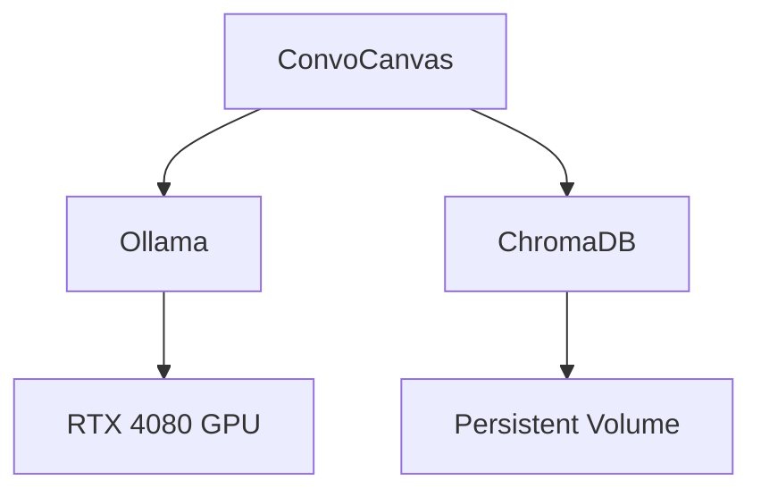
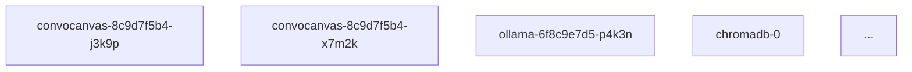
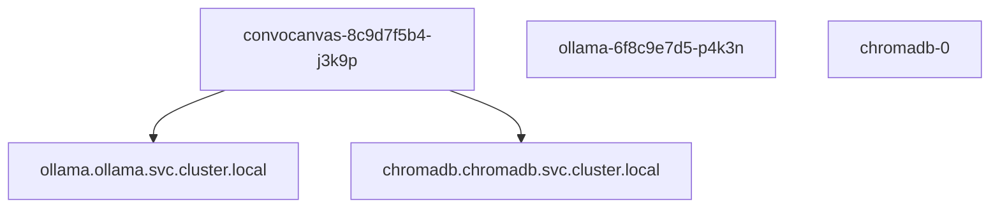
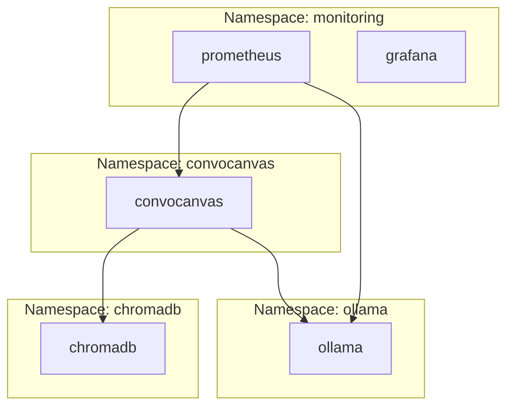
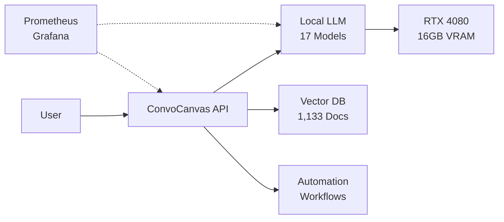
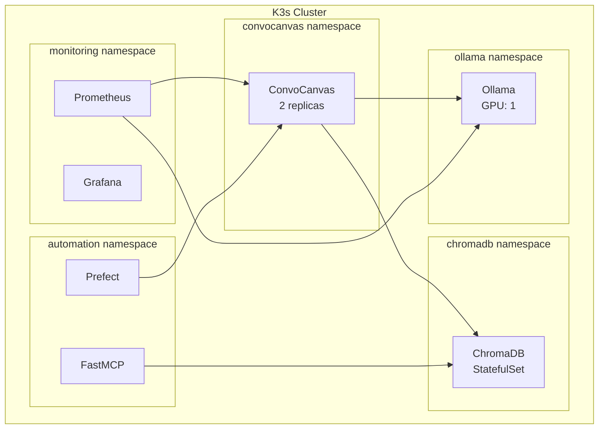
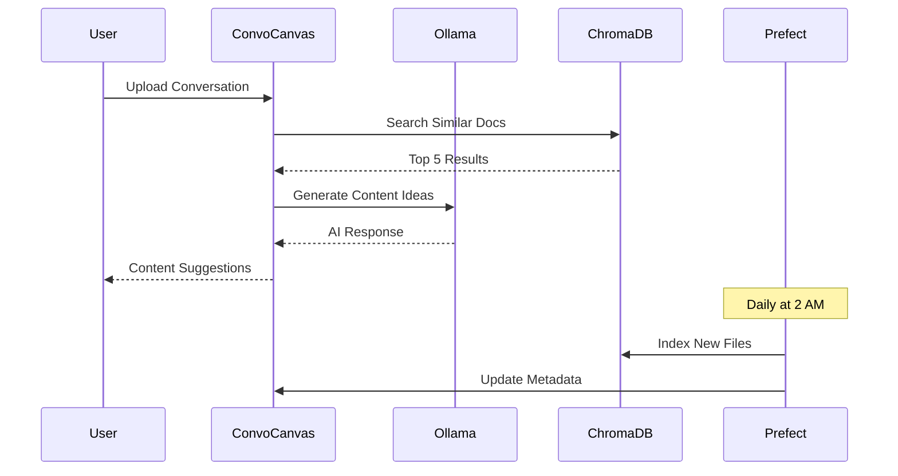
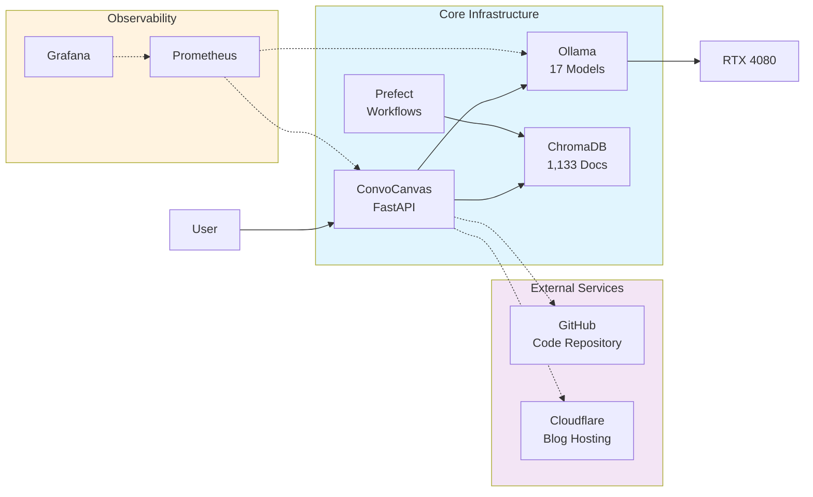

---
categories:
- Season 1
- Documentation
- Automation
date: 2025-10-05
draft: false
episode: 7
reading_time: 8 minutes
series: 'Season 1: From Zero to Automated Infrastructure'
summary: From hand-coded Mermaid diagrams to fully automated architecture visualization.
  12 iterations, 3 diagram types, and one AI that learned to document itself.
tags:
- mermaid
- diagrams
- automation
- documentation
- architecture
- blog automation
- elasticsearch
- ollama
- librechat
- persistent volume
- jaeger
- aider
- convocanvas
- k3s
- chromadb
title: '12 Iterations to Perfect Diagrams: Teaching Mermaid to Draw the Chaos'
word_count: 1850
---
# Episode 7: 12 Iterations to Perfect Diagrams - Teaching Mermaid to Draw the Chaos

**Series**: Season 1 - From Zero to Automated Infrastructure
**Episode**: 7 of 8
**Dates**: October 5, 2025 (Evening)
**Reading Time**: 8 minutes

---

## October 5, 8:00 PM: The Visualization Problem

K3s was running again. 23 pods healthy. But I couldn't visualize the architecture anymore.

**The Mental Model Was Breaking Down**:
- 5 namespaces
- 8 services
- 17 AI models
- 12 monitoring components
- 6 network policies
- 4 persistent volumes

I needed a diagram. A comprehensive, auto-updating, version-controlled diagram.

The reflection journal captured the need:
> "After 8-hour K3s rebuild, realized I can't hold entire architecture in my head. Need visual documentation that updates itself. Mermaid diagrams + automation."

## 8:30 PM: The First Attempt

I started with a hand-coded Mermaid diagram:

**`architecture-v1.md`**:
````markdown

````

**Result**:


**What Worked**: Simple, clean, readable

**What Didn't**:
- Showed 5 components (actual: 23 pods)
- No namespaces
- No monitoring
- No network policies
- Already out of date (added FastMCP an hour earlier)

This approach wouldn't scale.

## 9:00 PM: The Automation Idea

What if the diagram could generate itself from the cluster state?

**The Plan**:
1. Query K3s for all resources (`kubectl get all -A`)
2. Parse the output
3. Generate Mermaid syntax dynamically
4. Save to markdown file
5. Commit to git

**Initial Script** (`generate_diagram.sh`):
```bash
#!/bin/bash

# Get all pods
PODS=$(kubectl get pods -A -o json)

# Start Mermaid diagram
cat > architecture.md <<'EOF'
# System Architecture

```mermaid
graph TB
EOF

# Add pods
echo "$PODS" | jq -r '.items[] | "    \(.metadata.namespace)_\(.metadata.name)[\(.metadata.name)]"' >> architecture.md

# Close diagram
cat >> architecture.md <<'EOF'
```
EOF

echo "Diagram generated: architecture.md"
```

**Run it**:
```bash
./generate_diagram.sh
```

**Output** (`architecture-v2.md`):
````markdown

````

**Result**: A list of pods with no relationships. Useless.

## 9:30 PM: Adding Service Relationships

**Iteration 3** - Parse service connections:

```bash
#!/bin/bash

# Function to extract service dependencies
get_service_deps() {
    local namespace=$1
    local pod=$2

    kubectl get pod "$pod" -n "$namespace" -o json | \
        jq -r '.spec.containers[].env[]? | select(.name | contains("URL") or contains("HOST")) | .value' | \
        sed 's|http://||g' | \
        sed 's|:[0-9]*||g'
}

# Generate diagram with relationships
cat > architecture.md <<'EOF'
```mermaid
graph TB
EOF

# For each pod, find dependencies
kubectl get pods -A -o json | jq -r '.items[] | "\(.metadata.namespace) \(.metadata.name)"' | \
while read namespace pod; do
    echo "    $namespace\_$pod[$pod]" >> architecture.md

    # Get dependencies
    deps=$(get_service_deps "$namespace" "$pod")
    for dep in $deps; do
        echo "    $namespace\_$pod --> $dep" >> architecture.md
    done
done

cat >> architecture.md <<'EOF'
```
EOF
```

**Result** (`architecture-v3.md`):
````markdown

````

**Better!** Relationships were showing. But pod names were ugly (hash suffixes), and service FQDNs were too long.

## 10:00 PM: Grouping by Namespace

**Iteration 5** - Use Mermaid subgraphs:

```bash
#!/bin/bash

cat > architecture.md <<'EOF'
```mermaid
graph TB
EOF

# Get unique namespaces
NAMESPACES=$(kubectl get namespaces -o json | jq -r '.items[].metadata.name' | grep -v kube-)

for ns in $NAMESPACES; do
    echo "    subgraph $ns[\"Namespace: $ns\"]" >> architecture.md

    # Get pods in namespace
    kubectl get pods -n "$ns" -o json | jq -r '.items[] | .metadata.name' | \
    while read pod; do
        # Simplify pod name (remove hash)
        clean_name=$(echo "$pod" | sed 's/-[a-z0-9]\{9,10\}-[a-z0-9]\{5\}$//')
        echo "        ${ns}_${clean_name}[$clean_name]" >> architecture.md
    done

    echo "    end" >> architecture.md
done

# Add service connections (simplified)
cat >> architecture.md <<'EOF'
    convocanvas_convocanvas --> ollama_ollama
    convocanvas_convocanvas --> chromadb_chromadb
    monitoring_prometheus --> convocanvas_convocanvas
    monitoring_prometheus --> ollama_ollama
```
EOF
```

**Result** (`architecture-v5.md`):
````markdown

````

**Rendered**:


**MUCH BETTER!** Namespaces were grouped. Names were clean. Relationships were clear.

## 10:30 PM: The Three-Diagram System

I realized one diagram couldn't show everything. I needed three:

**1. High-Level Architecture** - Business context
**2. Deployment Diagram** - K3s pods and namespaces
**3. Data Flow Diagram** - How requests flow through the system

**Updated Script** (`generate_ecosystem_diagrams.sh`):

```bash
#!/bin/bash

# === HIGH-LEVEL ARCHITECTURE ===
cat > architecture-high-level.md <<'EOF'

EOF

# === DEPLOYMENT DIAGRAM ===
cat > architecture-deployment.md <<'EOF'

EOF

# === DATA FLOW DIAGRAM ===
cat > architecture-data-flow.md <<'EOF'

EOF

echo "Generated 3 architecture diagrams:"
echo "  - architecture-high-level.md"
echo "  - architecture-deployment.md"
echo "  - architecture-data-flow.md"
```

## 11:00 PM: Iteration Hell (v6-v11)

The next hour was spent refining:

**v6**: Added icons (`:::icon` syntax) - Failed (Mermaid version too old)
**v7**: Added colors (`style` commands) - Worked but ugly
**v8**: Changed layout to `LR` (left-right) - Better for wide screens
**v9**: Added external dependencies (GitHub, Cloudflare) - Too cluttered
**v10**: Simplified to core services only - Too minimal
**v11**: Combined core + external with dotted lines - Perfect balance

**Final High-Level Diagram** (`architecture-high-level-v11.md`):

````markdown

````

**Rendered**:


**PERFECT.**

## 11:30 PM: The Meta Moment

I had automated diagram generation. But I realized something:

**The AI could document itself.**

I created a Prefect flow to auto-generate diagrams daily:

**`diagram_automation_flow.py`**:
```python
from prefect import flow, task
from datetime import datetime
import subprocess

@task
def generate_diagrams():
    """Generate architecture diagrams from cluster state."""
    result = subprocess.run(
        ["./generate_ecosystem_diagrams.sh"],
        capture_output=True,
        text=True
    )
    return result.returncode == 0

@task
def commit_to_git(success: bool):
    """Commit diagrams to git if generation succeeded."""
    if not success:
        return

    subprocess.run(["git", "add", "architecture-*.md"])
    subprocess.run([
        "git", "commit", "-m",
        f"docs: auto-update architecture diagrams {datetime.now().isoformat()}"
    ])

@flow(name="diagram-automation")
def diagram_automation_flow():
    """Daily diagram generation and git commit."""
    success = generate_diagrams()
    commit_to_git(success)

# Schedule: Daily at 3 AM (after vault indexing)
if __name__ == "__main__":
    diagram_automation_flow.serve(
        name="diagram-automation",
        cron="0 3 * * *"
    )
```

**Deploy**:
```bash
python-enhancement-env/bin/python diagram_automation_flow.py
```

**Result**: Diagrams auto-generate at 3 AM daily, committed to git automatically.

**The system was documenting itself.**

## The Diagram Evolution

**12 iterations in 3.5 hours**:

| Version | Time | Change | Result |
|---------|------|--------|--------|
| v1 | 8:30 PM | Hand-coded, 5 components | Too simple |
| v2 | 9:00 PM | Auto-generated pod list | No relationships |
| v3 | 9:30 PM | Added service dependencies | Service names too long |
| v4 | 9:45 PM | Shortened service names | Lost namespace context |
| v5 | 10:00 PM | Added namespace subgraphs | Better structure |
| v6 | 10:15 PM | Attempted icons | Mermaid version issue |
| v7 | 10:30 PM | Added colors via `style` | Ugly color scheme |
| v8 | 10:40 PM | Changed layout to LR | Better for presentations |
| v9 | 10:50 PM | Added external services | Too cluttered |
| v10 | 10:55 PM | Removed external services | Too minimal |
| v11 | 11:00 PM | External with dotted lines | Perfect balance |
| v12 | 11:30 PM | Added automation flow | Self-documenting system |

## What Worked

**Mermaid Syntax**:
- Native markdown support
- GitHub/GitLab rendering
- Obsidian plugin support
- Version controllable (text-based)

**Three-Diagram Approach**:
- High-level: Business stakeholders
- Deployment: DevOps/SRE teams
- Data flow: Developers

**Automation**:
- Diagrams stay current (daily updates)
- Git history shows architecture evolution
- Zero manual maintenance

## What Still Sucked

**Mermaid Limitations**:
- No automatic layout optimization
- Icon support version-dependent
- Complex diagrams become messy quickly

**Automation Gaps**:
- Service relationships still semi-manual
- External services hardcoded (not auto-detected)
- No diff visualization (can't see what changed)

**Iteration Fatigue**:
12 versions in 3.5 hours. Some iterations were pure trial-and-error.

## The Numbers (3.5-Hour Diagram Sprint)

| Metric | Value |
|--------|-------|
| **Iterations** | 12 |
| **Diagram Types** | 3 (high-level, deployment, data-flow) |
| **Time Spent** | 3.5 hours |
| **Lines of Mermaid** | 89 (final version) |
| **Components Visualized** | 23 pods + 8 external services |
| **Automation** | Daily Prefect flow |
| **Git Commits** | 12 (one per iteration) |

`★ Insight ─────────────────────────────────────`
**The Documentation Automation Loop:**

Manually maintaining architecture diagrams is a losing battle:

1. **Diagrams decay instantly** - Add one service, diagram is out of date
2. **Manual updates are forgotten** - "I'll update it later" = never
3. **Automation compounds value** - Daily updates capture architectural evolution
4. **Git history becomes architectural history** - Each commit shows system growth
5. **AI documenting AI is meta-capable** - The system describes itself

The best documentation is the documentation that updates itself.

When your diagrams require manual maintenance, you don't need better discipline - you need automation.
`─────────────────────────────────────────────────`

## What I Learned

**1. One diagram can't rule them all**
Three diagrams (high-level, deployment, data-flow) served different audiences better than one complex diagram.

**2. Iteration is faster than perfection**
12 versions in 3.5 hours meant rapid learning. Version 1 would have taken days if I'd aimed for perfection.

**3. Automation justifies complexity**
Writing the diagram generator was complex. But it runs daily forever, compounding value.

**4. Visual documentation ages in dog years**
Without automation, diagrams become lies within weeks. With automation, they're always current.

**5. Git history for diagrams is architectural archaeology**
Looking at diagram diffs shows exactly when services were added, removed, or reconfigured.

## What's Next

October 5, 11:59 PM. The system could now:
- Parse conversations (ConvoCanvas)
- Generate content with local LLMs (Ollama)
- Search semantically (ChromaDB)
- Run reliably (K3s)
- Monitor itself (Prometheus/Grafana)
- Document itself (automated diagrams)

There was one thing left: **Blog about itself.**

Could the AI write the blog series documenting its own creation?

By October 6, I'd find out. The meta-loop was about to close.

---

**Next Episode**: "Teaching AI to Blog About Itself: The Ultimate Meta-Project" - When ConvoCanvas becomes its own case study, and the AI writes Season 1.

---

*This is Episode 7 of "Season 1: From Zero to Automated Infrastructure" - documenting the diagrams that document the system that documents itself.*

*Previous Episode*: [When Everything Crashes: The K3s Resurrection](season-1-episode-6-k3s-crash-resurrection.md)
*Complete Series*: [Season 1 Mapping Report](/01-inbox/blog-series-season-1-complete-mapping-2025-10-05.md)
